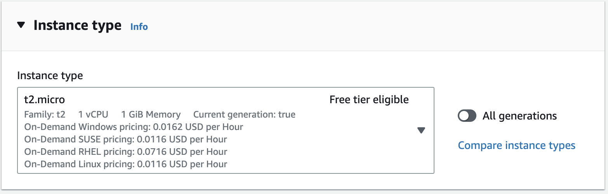

## Configuring an EC2 instance 

1. Sign in to the AWS Management Console and navigate to the EC2 service.

2. Click on the “Launch Instance”


3. Name your instance,and choose the `Amazon Machine Image(AMI)` for the operating system image


4. Select `t2.micro` as an Instance type



5. Now let’s create a key pair that will allow us to connect with our EC2 instance.


6. To control the traffic for our instance we have to configure the security groups. We will allow `SSH` to this instance and `HTTP` and `HTTPS` traffic from the internet.


7. Click on the launch instance button and our EC2 machine will be up and running in a couple of minutes

##  Connect to EC2 instance.


1. Lets connect with our EC2 instance copy the Public IPv4 address of the EC2 machine


2. Open the terminal and navigate to the location where we have stored the `key pair` file.

3. Enter the following command to modify the `.pem` file permission. Replace the `aws-key` with the key created while configuring the EC2 instance.  
 

```plaintext
chmod 400 aws-key.pem
```

4. Enter the following command to connect with our instance. Here `ec2-user` is the default user in AMI OS.

```plaintext
ssh -i aws-key.pem ec2-user@ec2-instance-public-IPv4 address
```

##  Now to install the Latest PHP, MySql, and nginx with composer to install all realated packages.

1.  To ensure that all of your software packages are up to date, perform a quick software update on your instance. This process may take a few minutes, but it is important to make sure that you have the latest security updates and bug fixes.
    
    The `-y` option installs the updates without asking for confirmation. If you would like to examine the updates before installing, you can omit this option.
    
    ```plaintext
    [ec2-user ~]$ sudo yum update -y
    ```
    
2.  Install the `mariadb10.5` Amazon Linux Extras repositories to get the latest version of the MariaDB package.
    
    ```plaintext
    [ec2-user ~]$ sudo amazon-linux-extras install mariadb10.5
    ```
    
    If you receive an error stating `sudo: amazon-linux-extras: command not found`, then your instance was not launched with an Amazon Linux 2 AMI (perhaps you are using the Amazon Linux AMI instead). You can view your version of Amazon Linux using the following command.
    
    ```plaintext
    cat /etc/system-release
    ```
    
3.  Install the `php8.2` Amazon Linux Extras repositories to get the latest version of the PHP package for Amazon Linux 2.
    
    ```plaintext
    [ec2-user ~]$ sudo amazon-linux-extras install php8.2
    ```
    
4.  Now that your instance is current, you can install the Nginx web server, MariaDB, and PHP software packages. Use the yum install command to install multiple software packages and all related dependencies at the same time
    
    ```plaintext
    [ec2-user ~]$ sudo yum install nginx
    ```
    
    You can view the current versions of these packages using the following command:
    
    ```plaintext
    yum info package_name
    ```
    
5.  Start the Apache web server.
    
    ```plaintext
    [ec2-user ~]$ sudo systemctl start nginx
    ```
    
6.  Use the **systemctl** command to configure the Apache web server to start at each system boot.
    
    ```plaintext
    [ec2-user ~]$ sudo systemctl enable nginx
    ```
    
    You can verify that `nginx` is on by running the following command:
    
    ```plaintext
    [ec2-user ~]$ sudo systemctl status nginx
    ```
    

## Now we will configure the nginx

1.  Create a default.conf file under `/etc/nginx/conf.d` dir
    
    ```plaintext
    [ec2-user ~]$ echo "<?php phpinfo(); ?>" > /var/www/html/phpinfo.php
    ```